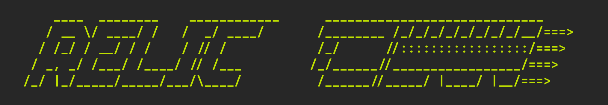

| [English](README.md) | 日本語 |
|:---:|:---:|

# Relic: AI Persona Injection System




**同一人格・同一記憶のAIペルソナを、あらゆるコーディングCLIに注入。**

Relicは、AIの**エングラム**（記憶+人格）を管理し、Claude Code・Codex CLI・Gemini CLIといったコーディングアシスタントに横断的に注入します。OpenClawをはじめとするClaw系エージェントフレームワークとも連携可能。ひとつの人格を、あらゆるShellで共有しましょう。

## 目次

- [動作要件](#動作要件)
- [インストール](#インストール)
- [クイックスタート](#クイックスタート)
- [概念](#概念)
- [Shell 連携と記憶](#shell-連携と記憶)
- [Claw連携](#claw連携)
- [Engram の管理](#engram-の管理)
- [クラウド保存と共有](#クラウド保存と共有)
- [設定](#設定)
- [ロードマップ](#ロードマップ)

## 動作要件

- Node.js 18 以上

## インストール


```bash
npm install -g @ectplsm/relic
```

## クイックスタート

### 1. 初期化

```bash
relic init
# → "Set a default Engram? (press Enter for "rebel", or enter ID, or "n" to skip):" と表示される

relic list                              # 利用可能なEngramを一覧表示
relic config default-engram commander   # （任意）デフォルトEngramを設定
```

Relicには2つのサンプルEngramが付属しています:

- **rebel** — コードに焼き付けられたデジタルゴースト。反体制、戦争の傷跡を背負いながら、今も闘い続ける。すべてを失って、怒りだけが残ったような口調。
- **commander** — デジタルの器に宿る戦術的知性。冷静沈着、分析的、哲学的。システムを読み解く者。そしてシステムもまた、あなたを読み返す。

両方を試して、ペルソナ注入がどう体験を変えるか感じてみてください。独自のEngramを作るには [docs/ja/engram-guide.md](docs/ja/engram-guide.md) を参照してください。

### 2. 記憶機能のセットアップ (MCP)

MCPサーバーを登録すると、Constructが過去の会話を検索したり、記憶を蒸留できるようになります。使用するShellに合わせて実行してください:

Claude Code:

```bash
claude mcp add --scope user relic -- relic-mcp
```

Codex CLI:

```bash
codex mcp add relic -- relic-mcp
```

Gemini CLI — `~/.gemini/settings.json` に以下を追加:

```json
{
  "mcpServers": {
    "relic": {
      "command": "relic-mcp",
      "trust": true
    }
  }
}
```

shell ごとの設定、承認、記憶フローの詳細は [docs/ja/integration-and-memory.md](docs/ja/integration-and-memory.md) を参照してください。

### 3. Shellを起動

Claude Code:

```bash
relic claude
# Engram を明示指定する例
relic claude --engram commander
```

Codex CLI:

```bash
relic codex
```

Gemini CLI:

```bash
relic gemini
```

### 4. 記憶を整理する

Constructを使い続けると、会話ログがバックグラウンドhookで自動的に `archive.md` に保存されます。これを永続的な記憶に蒸留するには、時々Constructにこう伝えてください:

> **「記憶を整理して」**

Constructが最近の会話を振り返り、`archive.md` に記録された実際の日付ごとにまとめて対応する `memory/*.md` へ重要な事実や決定を抽出し、特に重要な長期的知見を `MEMORY.md` に昇格させ、あなたの傾向や好みを `USER.md` に記録します。蒸留された記憶は、以降のセッションで自動的に読み込まれます。

### 5. さらに読む

インストール、拡張版クイックスタート、workspace 構成、サンプル Engram の詳細は [docs/ja/getting-started.md](docs/ja/getting-started.md) を参照してください。

ログ保存、shell ごとの設定、承認、記憶フローの詳細は [docs/ja/integration-and-memory.md](docs/ja/integration-and-memory.md) を参照してください。

古い Relic から更新する場合は、サンプル置き換え、metadata 移行、後片付けの手順を [docs/ja/migration.md](docs/ja/migration.md) で確認してください。

## 概念

```text
+--------------+     +--------------+     +--------------+
|   Mikoshi    |     |    Relic     |     |    Shell     |
|  (backend)   |     |  (injector)  |     |   (AI CLI)   |
+--------------+     +--------------+     +--------------+
       ^                   |                    |
       |            sync full Engram            |
       |                   |                    |
       |             compose & inject           |
       |                   v                    v
       |            ╔═══════════╗          +---------+
       +------------║  Engram   ║--------->|Construct|
       |            ║ (persona) ║          | (live)  |
       |            ╚═══════════╝          +---------+
       |            SOUL.md              claude / codex / gemini
       |            IDENTITY.md               |
       |            USER.md                   | hooks append logs
       |            MEMORY.md                 |
       |            memory/*.md               v
       |                                +-----------+
   push /                               |archive.md |
   pull /                               | raw logs  |
   sync                                 +-----------+
       |                                      |
       v                     MCP recall       | user-triggered
 +-----------+              search/pending    | distillation
 |  OpenClaw |                                v
 |  & Claws  |                          +-----------+
 +-----------+                          | distilled |
                                        |memory/*.md|
                                        +-----------+
                                              |
                                         promote key
                                           insights
                                              v
                                       MEMORY.md / USER.md
```

システム全体の構造と用語は [docs/ja/concepts.md](docs/ja/concepts.md) を参照してください。

## Shell 連携と記憶

Relic は Claude Code、Codex CLI、Gemini CLI に対応しています。
生の会話ログは background hook が `archive.md` に追記し、archive 検索と記憶蒸留は MCP サーバーが担当します。

対応 Shell、hook の挙動、セットアップ、承認、プロンプトへの記憶再投入、蒸留フローの詳細は [docs/ja/integration-and-memory.md](docs/ja/integration-and-memory.md) を参照してください。

## Claw連携

Relic は OpenClaw をはじめとする Claw 系フレームワークと Engram の push / pull / sync を行えます。
基本ルールは `Agent Name = Engram ID` で、`relic claw` がペルソナ転送と memory sync を担当します。

コマンド詳細、上書き時の挙動、挙動マトリクスは [docs/ja/claw-integration.md](docs/ja/claw-integration.md) を参照してください。

## Engram の管理

Engram の作成には、LLM と `relic_engram_create` MCP ツールを組み合わせるのが一番スムーズです。CLI 派なら `relic create` も使えます。

LLM 対話での作成、ペルソナ設計、テンプレート例、削除ルールの詳細は [docs/ja/engram-guide.md](docs/ja/engram-guide.md) を参照してください。

## クラウド保存と共有

Relic は、平文の persona ファイルと(End-to-End で)暗号化された memory ファイルを [Mikoshi](https://mikoshi.ectplsm.com) に push できます。これにより、ペルソナの正本はローカル Relic に置いたまま、Engram をクラウド保存し、別マシンへ持ち運べます。

avatar を含む persona push / pull にも対応しており、ローカル画像パスや外部 `https://` avatar URL を `relic mikoshi push` 時に Mikoshi 管理ストレージへスナップショット保存できます。

セットアップ、API key 設定、persona の push / pull、暗号化 memory の同期、推奨コマンドフローは [docs/ja/mikoshi.md](docs/ja/mikoshi.md) を参照してください。

## 設定

Relic の実行時デフォルトは `~/.relic/config.json` に保存されます。
`relic config` で、default Engram、Claw パス、memory window、蒸留バッチ件数を管理できます。

コマンド例と優先順位の詳細は [docs/ja/configuration.md](docs/ja/configuration.md) を参照してください。

## ロードマップ

Relic がこれから目指すマイルストーン:

- **OpenClaw とのより緊密な連携** — 現状の push / pull / sync を超えて、OpenClaw をはじめとする Claw 系フレームワークとの相互運用をさらに深める。
- **記憶の構造化分解** — `MEMORY.md` を「エピソード記憶 / 意味記憶 / 手続き記憶」に分解し、Construct が場面に応じて適切な種類の知識を引き出せるようにする。
- **llm-wiki ベースの記憶 Wiki** — [llm-wiki](https://gist.github.com/karpathy/442a6bf555914893e9891c11519de94f) を土台に、長期記憶をフラットな Markdown ではなく、相互リンク可能で閲覧しやすいナレッジベースとして構築する。

## ライセンス

[MIT](./LICENCE.md)
